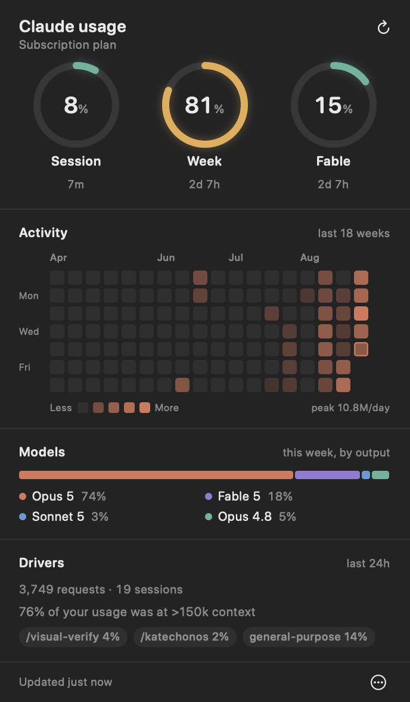
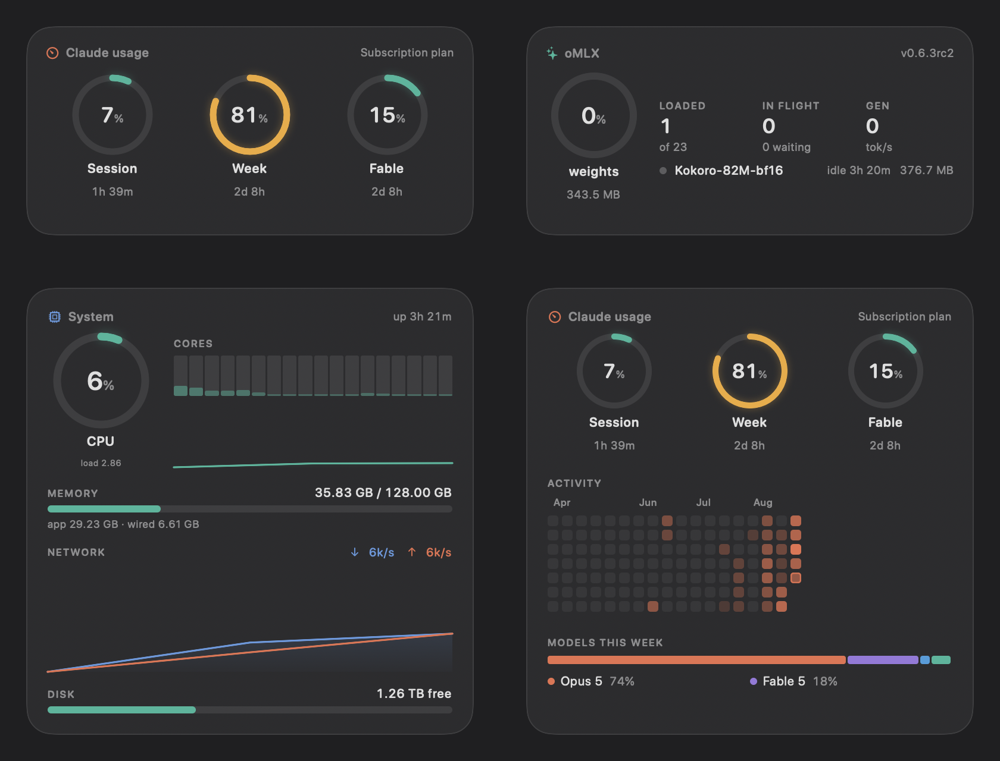

# Metron

A macOS menu bar app for the numbers you'd otherwise have to go and look up —
Claude usage limits, this machine, the local oMLX server, the NAS. Each one is
its own menu bar item and its own desktop widget, so a glance is usually enough.





## The glances

Each glance is an independent readout: its own menu bar slot, its own refresh
cadence, its own desktop widget. Turn them on and off from the ••• menu under
**Glances**. Only **Claude usage** is on to begin with.

### Claude usage

- **Limit rings** — every window the server reports (5-hour session, weekly
  all-models, weekly per-model such as Fable), each with a live countdown to
  its reset. The ring turns amber past 70% and red past 90%.
- **Menu bar glyph** — a filled ring plus the percentage of whichever window is
  closest to its ceiling.
- **Activity heatmap** — a GitHub-style contribution grid of the last 18 weeks,
  built from your local Claude Code transcripts.
- **Model split** — which models did this week's work, by output tokens.
- **Drivers** — the same "what's contributing to your limits" attribution the
  `/usage` dialog shows: behaviours, top skills, subagents and MCP servers.

### System

CPU with a per-core strip, memory the way Activity Monitor counts it, network
throughput up and down, and disk headroom. Read straight from the kernel —
`host_processor_info`, `host_statistics64`, `NET_RT_IFLIST2` — with no polling
of external tools.

The menu bar ring tracks CPU by default; **Menu bar shows** switches it to
memory, network or whichever of the three is currently highest.

### oMLX

The local [oMLX](https://omlx.app) server: which models are resident and what
each is doing, requests in flight, prefill and generation tok/s, cache hit rate,
and how much of the weight budget is committed.

### KatechonOS

The NAS: pool health and fullness, every cell's quota and how much of it is
spent, which services are up, and which image the machine booted against its
rollback. A degraded pool or a down service outranks a full one in the menu bar
glyph — the point of a glance is to surface what you'd otherwise learn too late.

## Where the numbers come from

| Glance | Source | Covers |
|---|---|---|
| Claude usage — rings | `~/.claude.json` (the CLI's own cache) | Your account: all devices and claude.ai |
| Claude usage — drivers | `claude -p "/usage"` | Your account, when the command prints |
| Claude usage — heatmap, models | `~/.claude/projects/**/*.jsonl` | Claude Code on **this machine** only |
| System | Mach and sysctl | This machine |
| oMLX | `http://127.0.0.1:8000` | The local oMLX server |
| KatechonOS | `ssh <host> katechon state` | The NAS |

No glance holds a credential of its own. The limit rings come from
`cachedUsageUtilization` in `~/.claude.json` — Claude Code's own cache of the
account's utilisation, refreshed whenever it runs. Reading it is instant, needs
no credential, and does not depend on a slash command choosing to print
anything: `/usage` went silent in non-interactive mode, and the rings kept
working because they no longer go through it. The tradeoff is worth stating —
that cache only moves when Claude Code runs, so if you haven't used it in a day
the numbers are a day old, and the panel says so rather than pretending.

The Drivers block still comes from `claude -p "/usage"`, which is tried at most
once every ten minutes and simply leaves that section out when it prints
nothing. oMLX doesn't ask
for a key on localhost. KatechonOS goes over ssh, so it uses the key you already
have. Metron deliberately never reads oMLX's `/admin/api/stats`, which returns
the server's API key in cleartext — a widget has no business holding one.

The heatmap and model split are a *local* view. They deliberately do not match
the limit rings: they can't see claude.ai chats or your other machines, and they
count output tokens rather than the server's cost weighting. Treat them as a
picture of your own working rhythm, not as an audit of the limit.

## Install

```bash
./build.sh
cp -R dist/Metron.app /Applications/
open -a Metron
```

Then, from the ••• menu, turn on **Launch at login**.
(Launch at login only works from `/Applications`.)

Requires macOS 14 or later. There is nothing to fetch — the package has no
dependencies.

Prebuilt zips are attached to each [release]. They are universal (Apple silicon
and Intel) but **ad-hoc signed and not notarised**, so macOS quarantines them on
download and reports the famously unhelpful *"Metron is damaged"*. Either strip
the flag —

```bash
xattr -dr com.apple.quarantine Metron.app
```

— or just build from source, which never picks up a quarantine flag at all.

[release]: https://github.com/Band-of-Reeves/Metron/releases

## Desktop widgets

Any glance can live on the desktop in one of four sizes — **Small**, **Medium**
and **Large**, laid out to the same proportions macOS gives its own desktop
widgets, plus **Full**, the complete panel. Pick one under **Widget size**, then
**Show desktop widget**.

A widget drags from anywhere on its face and remembers where you put it,
including which display. **Widget sits** chooses whether it floats above your
other windows or tucks behind them like wallpaper furniture. If the display it
was parked on goes away, it snaps back onto an attached screen rather than
stranding itself offscreen.

If a widget is parked behind other windows — or on a display that's awkward to
drag to — **Move widget to** places it on any attached display directly.

### Why these aren't WidgetKit widgets

macOS's own desktop widgets are `WidgetKit` extensions, and Metron's are not,
on purpose. A WidgetKit timeline reload is budgeted by the system: a widget gets
on the order of tens of refreshes a day, and cannot ask for more. That is fine
for a weather forecast and useless for a CPU meter or a limit that moves while
you work. These are ordinary windows, so they update on the cadence you choose,
down to a second.

## Settings

All in the ••• menu, and everything except **Glances**, **Launch at login** and
the menu bar reading is per glance: refresh interval, widget size, where the
widget sits, and which display it's on.

A few things have no UI and are read from user defaults:

```bash
# Point the oMLX glance somewhere other than the default.
defaults write com.watchman.metron omlx.baseURL -string "http://127.0.0.1:8000"

# Which host the KatechonOS glance reaches over ssh (default: katechon).
defaults write com.watchman.metron katechon.host -string "katechon.local"

# Or read it over HTTP instead, if you have a tunnel to katechon-ui-serve.
defaults write com.watchman.metron katechon.baseURL -string "http://localhost:7373"
```

## Development

```bash
swift build -c release          # the fast loop
swift test                      # pure logic; needs no live data
./build.sh                      # assemble dist/Metron.app
METRON_UNIVERSAL=1 ./build.sh   # arm64 + x86_64, for something you hand out
```

`Metron --render out.png` renders a glance to an image with live data — useful
for design review, since a menu bar popover and a borderless widget are both
awkward to screenshot.

```bash
Metron --render out.png --glance system --size large
Metron --render out.png --glance usage  --size full --window
```

`--glance` takes `usage`, `system`, `omlx` or `katechon`; `--size` takes
`small`, `medium`, `large` or `full`. Add `--window` to render through real
AppKit (needed for controls `ImageRenderer` can't draw), `--light` for the light
appearance, `--scale N` for the pixel scale.

`./verify.sh` is the short answer to "is it actually working?" — it builds,
checks every popover against its panel, renders every glance and **asserts on
the headline rather than on the render succeeding**, and confirms the limit
cache still has the key the rings read. It exits non-zero on the first real
failure, so it can be read in one glance instead of audited.

```
live data
  ok   usage — 83% (83%)
  ok   system — 13% (13%)
```

A glance that renders but has nothing to show is the failure that looks like
success; that is the one this is built to catch.

It will report `FAIL` for glances whose sources you don't have — an oMLX server,
a NAS — which is expected on any machine but the author's. CI runs
`METRON_VERIFY_CI=1 ./verify.sh`, which runs the build and geometry checks and
marks the live-data ones `skip` rather than pretending they passed.

`Metron --measure` opens each popover against an offscreen anchor and checks
that it ends up exactly as tall as the panel inside it — the regression a
headless run can't screenshot. It exits non-zero if any popover would clip.

### Adding a glance

Subclass `GlanceStore`, override `load()`, `headline` and `content(_:)`, and add
it to the list in `GlanceRegistry`. Everything else — the menu bar slot, the
refresh timer, the desk window and its four sizes, the settings menu, the
`--render` path — comes with it. `Kit/` holds nothing domain-specific; the four
glances under `Glances/` hold nothing shared.

## Notes

- The heatmap only goes back as far as your transcripts do; it fills in as you
  work.
- Transcript scanning caches per file by size and mtime, so refreshes after the
  first are cheap. A cold scan of ~470 files / 340 MB takes well under a second.
- The System glance's rate figures — CPU busy share, network throughput — are
  differences between consecutive samples, so the first reading after launch is
  zero and settles on the next tick.
- The KatechonOS glance gives up on an unreachable host after 12 seconds.
  `ConnectTimeout` doesn't bound name resolution, and an unresolvable `.local`
  host can otherwise leave `ssh` wedged in mDNS for minutes.

## Contributing

See [CONTRIBUTING.md](CONTRIBUTING.md) — it covers what a fresh clone actually
gives you (only the Claude usage glance is on by default; the others describe
hardware that probably isn't yours), how to add a glance, and the handful of
design decisions that are settled. [CHANGELOG.md](CHANGELOG.md) tracks releases.

MIT licensed.
